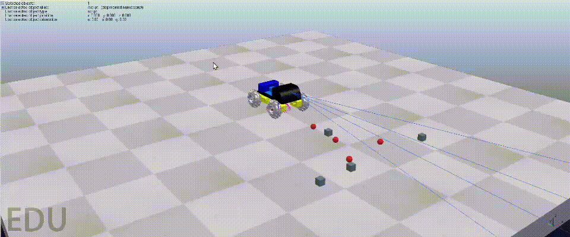

# Elementos de Robótica

Repositório destinado à gerência das atividades da disciplina Elementos de Robótica (2025.2), contendo simulações e arquivos utilizados no desenvolvimento do robô coletor de metais.

O projeto contém cenas e scripts para CoppeliaSim (antigo V-REP), modelos 3D e material de apoio usados no desenvolvimento e demonstração de um robô capaz de detectar e coletar objetos metálicos em terrenos irregulares.

Principais objetivos:
- Demonstrar navegação em terreno irregular.
- Detectar e diferenciar objetos metálicos.
- Coletar objetos metálicos com uma estratégia de otimização de energia.

## Sumário
- [Visão geral](#elementos-de-robótica)
- [Pré-requisitos](#pré-requisitos)
- [Simulação](#simulação-no-coppelia-sim)
- [Protótipo físico](#protótipo-físico)
- [Estrutura do repositório](#estrutura-do-repositório)

## Pré-requisitos
- CoppeliaSim (versão compatível; testar com a versão mais recente disponível em https://www.coppeliarobotics.com/).
- (Opcional) Arduino IDE e módulo Bluetooth para protótipo físico.

## Simulação no Coppelia Sim


Modelo 3D desenvolvido para o projeto: [Tinkercad](https://www.tinkercad.com/things/0kurSNMwIgs/edit?sharecode=BUHMEo9sgqf5a5IYN_LZvXjRUPOJ2kw7aipZHsgBEIY).

O robô foi projetado para se locomover em terrenos irregulares e instáveis, como áreas arenosas.

### Componentes do Robô
- **Detecção**:
  - Sensor de proximidade para simular eletroímã
  - Script para diferenciar objetos metálicos e não-metálicos
- **Controle**:
  - Script em Lua conectado ao CoppeliaSim
  - Comandos de movimento via teclado

### Vídeos da Simulação
<p align="center">
  <table>
    <tr>
      <td align="center">
        <br/>
        <sub><b>Robô andando em terreno irregular</b></sub>
      </td>
      <td align="center">
        <br/>
        <sub><b>Robô coletando metais</b></sub>
      </td>
    </tr>
  </table>
</p>

### Controles
O controle é feito através das teclas:

- **W**: Movimentação para frente.
- **S**: Movimentação para trás.
- **A**: Rotaciona para esquerda.
- **D**: Rotaciona para direita.
- **Espaço**: Parar o robô.
- **Q**: Interrompe a translação do robô.
- **R**: Interrompe a rotação do robô.
- **M**: Ativar/desativar eletroímã.

### Otimização de Energia

Foi implementada uma estratégia para maximizar a eficiência da bateria do robô. O intuito é fazer com que o robô calcule e percorra o **menor caminho** entre os materiais metálicos identificados no ambiente, de maneira a otimizar da melhor forma possível o gasto energético durante a coleta.

<p align="center">
  <br/>
  <sub><b>Demonstração do trajeto otimizado</b></sub>
</p>

### Como executar a simulação

1. Abra o CoppeliaSim.
2. No menu `File > Open scene`, navegue até a pasta `coppelia/` e abra uma das cenas disponíveis, por exemplo `robot_movimentation.ttt` ou `metal_collector.ttt`.
3. Inicie a simulação clicando em "Start" no CoppeliaSim.
4. Use os controles descritos para pilotar o robô na simulação.

## Protótipo físico

Para demonstração prática foi montado um protótipo controlado por Arduino com comunicação Bluetooth. Para simplificar a demonstração, o eletroímã foi substituído por um ímã permanente.

Lista de materiais (exemplo):
- 1x Arduino Uno
- 4x Rodas com motores DC
- 1x Driver de motor (ex.: L298N)
- 1x Módulo Bluetooth (ex.: HC-05)
- 2x Baterias 3.7V (Li-Ion)
- Jumpers e suporte mecânico

<p align="center">
  <br/>
  <sub><b>Demonstração da movimentação do robô</b></sub>
</p>

## Estrutura do repositório

```bash
elementos-de-robotica/
├── coppelia/               # Cenas (.ttt)
│   ├── metal_collector.ttt
│   ├── robot_movimentation.ttt
│   └── smart_metal_collector.ttt
├── figs/                   # Imagens e GIFs da documentação
├── README.md               # Documentação em Português
└── README_es.md            # Documentación en Español
```
