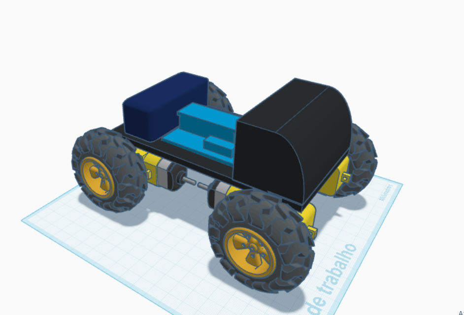

  <a href="./README.md">🇧🇷 Português</a> |
  <a href="./README_es.md">🇪🇸 Español</a>

# Elementos De Robotica

Repositório destinado à gerência das atividades da disciplina Elementos de Robótica (2025.2), contendo simulações e arquivos utilizados no desenvolvimento do robô coletor de metais.

## Simulação no Coppelia Sim

Modelo 3D desenvolvido para o projeto: [Tinkercad](https://www.tinkercad.com/things/0kurSNMwIgs/edit?sharecode=BUHMEo9sgqf5a5IYN_LZvXjRUPOJ2kw7aipZHsgBEIY).

O robô foi projetado para se locomover em terrenos irregulares e instáveis, como áreas arenosas.

### Componentes do Robô
- **Detecção**:
  - Sensor de proximidade para simular eletroímã
  - Script para diferenciar objetos metálicos e não-metálicos
- **Controle**:
  - Script em Lua conectado ao CoppeliaSim
  - Comandos de movimento via teclado

### Vídeos da Simulação

  <table>
    <tr>
      <td align="center">
         
        <b>Robô andando em terreno irregular</b>
      </td>
      <td align="center">
         
        <b>Robô coletando metais</b>
      </td>
    </tr>
  </table>

### Controles
O controle é feito através das teclas:

- **W**: Movimentação para frente.
- **S**: Movimentação para trás.
- **A**: Rotaciona para esquerda.
- **D**: Rotaciona para direita.
- **Espaço**: Barra de espaço para o robô.
- **Q**: Interrompe a translação do robô.
- **R**: Interrompe a rotação do robô.
- **M**: Ativar/desativar eletroímã.
